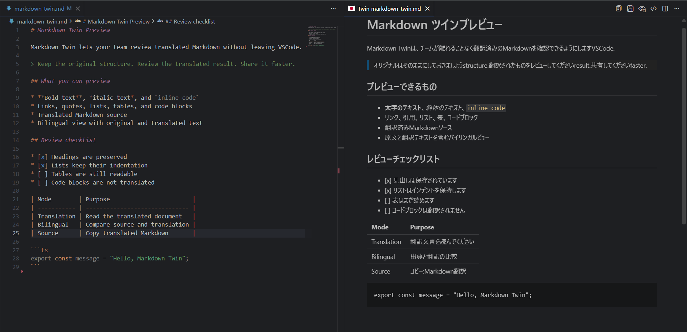
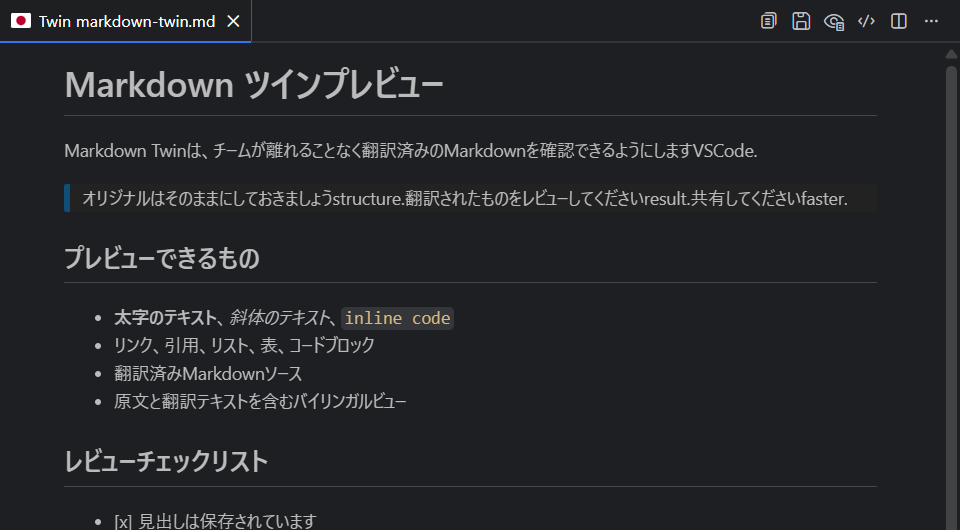
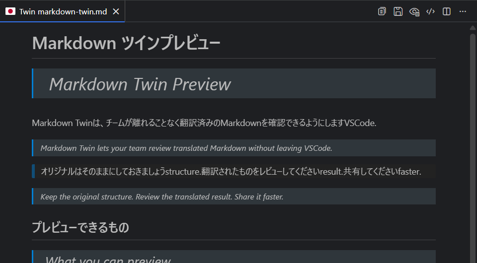
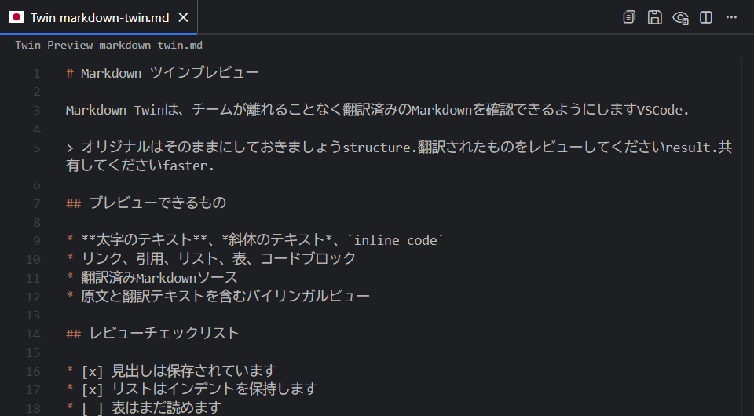

# Markdown Twin

日本語で書いたドキュメントを、外国語を母語とするチームメンバーと共有したいとき、毎回翻訳ツールにコピーするのは手間がかかります。

Markdown Twinは、そのギャップを埋めるために作りました。Markdownを書きながら、翻訳結果をVSCode上でそのまま確認・共有できます。

## 機能

- Markdownファイルを翻訳した言語でプレビュー
- 翻訳プレビューで原文と翻訳を並べるバイリンガル表示
- 翻訳済みMarkdownをソース表示に切り替え
- 複数のMarkdownタブ・言語ごとのプレビューパネルに対応
- 翻訳済みMarkdownのコピー・ファイル書き出し
- VSCode標準のMarkdownプレビューに近い表示

## プレビュー

翻訳結果は専用のPreviewに表示します。
**翻訳表示**と、原文と翻訳を並べる**バイリンガル表示**、翻訳語ソース表示に切り替えられます。

## 使い方

1. Markdownファイルを開きます。
2. 右下のステータスバーにある **Markdown Twin** をクリックします。
3. Quick Pickメニューから翻訳サービス・APIキー・翻訳先言語を設定します。
4. **Toggle Translation** を選択して翻訳プレビューを開きます。
5. 右上の、国旗アイコンをクリックして翻訳します。

## 翻訳プロバイダー

以下のプロバイダーに対応しています。  
APIキーを取得し、`Markdown Twin: Set API Key` から設定してください。  
※Azure Translatorを使う場合は、APIキーに加えてリージョン`markdownTwin.azureRegion`の設定が必要です。

- Azure Translator
- Google Cloud Translation
- DeepL
- Papago

## 対応言語

### 翻訳先言語

- 日本語 / 英語 / 韓国語
- 簡体字中国語 / 繁体字中国語
- スペイン語 / フランス語 / ドイツ語 / イタリア語 / ポルトガル語
- ロシア語 / ベトナム語 / タイ語 / インドネシア語
- アラビア語 / ヒンディー語

翻訳サービスごとに異なる言語コードはMarkdown Twinが内部で変換します。

### UI表示言語

英語・日本語・韓国語・簡体字中国語・繁体字中国語

※VSCodeの表示言語が対応していない場合は英語で表示されます。

プライバシーとセキュリティ・既知の制限

**プライバシーとセキュリティ**

テレメトリは収集しません。翻訳を有効にすると、翻訳対象のテキストが選択中の翻訳サービスに送信されます。機密ドキュメントで利用する場合は、各サービスのプライバシーポリシーを確認してください。

**既知の制限**

- 翻訳品質・対応言語・レート制限・料金は翻訳サービス側の仕様に依存します。
- 大きなファイルでは翻訳に時間がかかることがあります。
- コードブロックは翻訳対象から外しますが、周辺の文章は翻訳サービスの応答によって変わることがあります。
- オフライン時はセッション内キャッシュのみ表示されます。

## ライセンス

MIT
