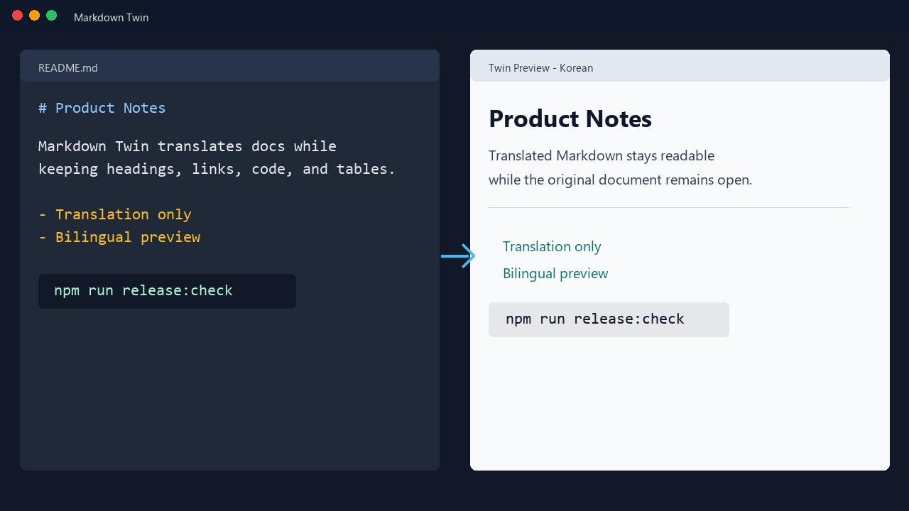

# Markdown Twin

Markdown Twin is a Visual Studio Code extension for translating Markdown documents and viewing the translated result alongside the original authoring experience.

It is designed for documentation workflows where you want to keep writing in Markdown while checking a translated preview or translated source view.



## Features

- Translate Markdown documents using your configured translation provider.
- Show translated Markdown preview in a VS Code webview.
- Show translated source view with Markdown-like code rendering.
- Switch between translation-only and bilingual display modes.
- Keep Markdown preview behavior close to VS Code's built-in Markdown preview.
- Preserve Markdown structure for headings, lists, tables, links, images, code blocks, and front matter.
- Support multiple Markdown tabs and translated preview panels.
- Copy or export translated Markdown.

## Supported Translation Providers

- Azure Translator
- Google Cloud Translation
- DeepL
- Papago

API keys are stored using VS Code SecretStorage.

### Provider Setup Notes

- Google Cloud Translation: configure a Google Cloud Translation API key with `Markdown Twin: Set / Change API Key`.
- Azure Translator: configure an Azure Translator key and set `markdownTwin.azureRegion` to your resource region, such as `global`, `japaneast`, or `eastus`.
- DeepL: configure a DeepL API key. Supported language behavior depends on your DeepL plan and endpoint.
- Papago: configure your Papago credentials. Supported language pairs depend on the provider.

## Supported Translation Languages

Markdown Twin currently supports:

- Japanese
- English
- Korean
- Simplified Chinese
- Traditional Chinese
- Spanish
- French
- German
- Italian
- Portuguese
- Russian
- Vietnamese
- Thai
- Indonesian
- Arabic
- Hindi

Provider-specific language code differences are handled internally by Markdown Twin.

## Display Languages

The extension UI supports:

- English
- Japanese
- Korean
- Simplified Chinese
- Traditional Chinese

If your VS Code display language is not supported, Markdown Twin falls back to English.

## Getting Started

1. Open a Markdown file.
2. Run `Markdown Twin: Set API Key` and configure an API key for your translation provider.
3. If you use Azure Translator, enter the Azure region when prompted after saving the API key.
4. Run `Markdown Twin: Select Translation Provider` to choose the provider, output language, and display mode.
5. Run `Markdown Twin: Toggle Translation`.

## Settings

- `markdownTwin.provider`: Active translation provider.
- `markdownTwin.azureRegion`: Azure region for Azure Translator.
- `markdownTwin.sourceLanguage`: Source language for translation.
- `markdownTwin.targetLanguage`: Target language for translation.
- `markdownTwin.defaultMode`: Default display mode.
- `markdownTwin.batchSize`: Number of blocks to translate per batch.
- `markdownTwin.debounceDelay`: Delay before re-translating after document changes.

Provider, API key, and Azure region can also be configured from the Markdown Twin Quick Pick menu.

Useful commands:

- `Markdown Twin: Set API Key`
- `Markdown Twin: Configure Azure Region`
- `Markdown Twin: Select Translation Provider`
- `Markdown Twin: Open Settings`

## Privacy And Security

Markdown Twin does not collect telemetry.

When translation is enabled, the text selected for translation is sent to the configured translation provider. Review the privacy policy and terms of your selected provider before using this extension with confidential documents.

API keys are stored in VS Code SecretStorage and are not written to the workspace.

## Notes

Translation quality, supported languages, rate limits, and pricing depend on the selected translation provider.

Some providers may support the same language with different API language codes. Markdown Twin normalizes these differences internally.

## Known Limitations

- Translation quality, availability, limits, and pricing are controlled by the selected translation provider.
- Very large Markdown documents may take longer to translate because Markdown Twin translates content in batches.
- Markdown Twin preserves code blocks and inline code-like content, but provider responses can still alter surrounding prose.
- Offline use is limited to already-cached translations from the current VS Code session.

## Release Checks

Before packaging a release, run:

```bash
npm run release:check
```

This compiles TypeScript, runs the Jest suite, bundles the extension, and builds a VSIX package.

## License

MIT
